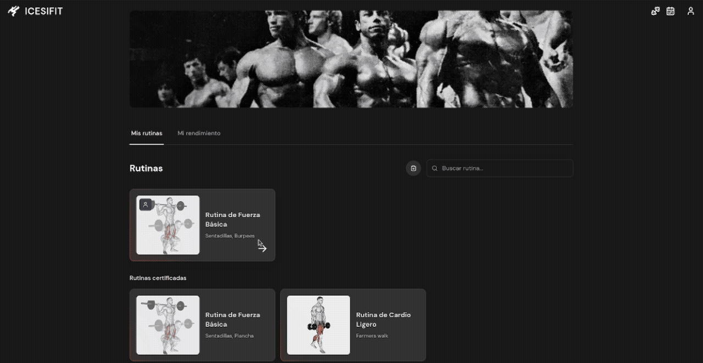
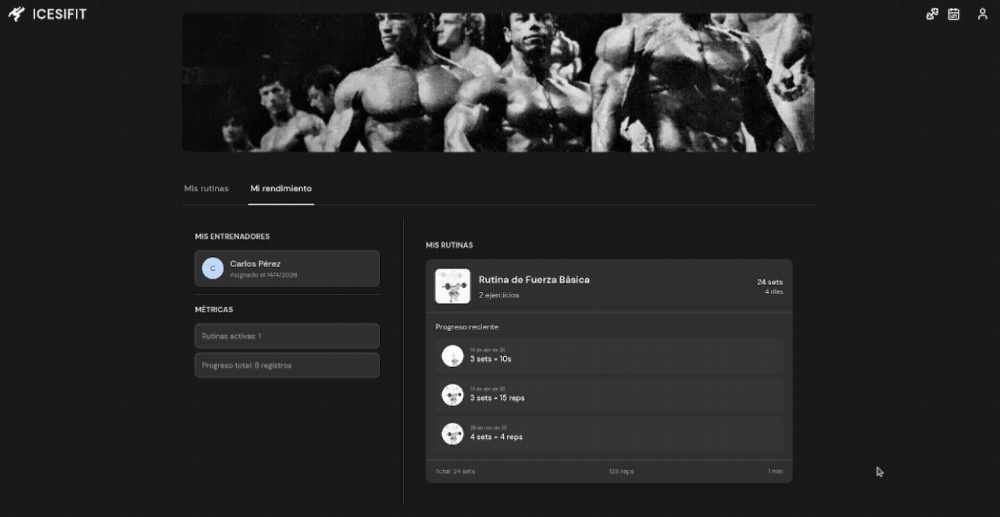
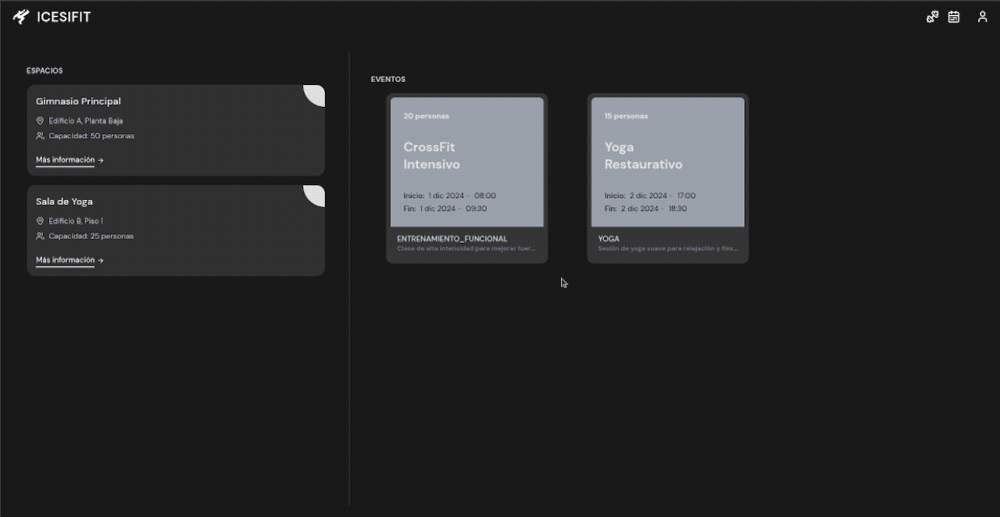

## IcesiFit (frontend)

A modern React-based frontend for the physical activity system built for Universidad Icesi.

  

It provides an interactive and responsive interface for managing training routines, tracking progress, visualizing statistics, and interacting with real-time features such as notifications.

The application is designed as a **mobile-first SPA**, focused on usability, performance, and smooth user experience across different roles (students, trainers, and administrators).

It communicates with a Spring Boot backend through REST APIs and WebSockets, enabling real-time updates across the system.

#### Tech Stack

Built with React, the application uses Redux Toolkit for state management and redux-persist for session persistence.

Routing is handled with React Router v7, and styling is based on **TailwindCSS**, while real-time features are implemented using **SockJS + STOMP**, enabling live updates from the backend.

---

#### Key features

The frontend supports role-based dashboards for users and trainers, dynamic routing based on authentication state, and real-time notifications.

It includes interactive progress tracking, workout routine visualization, and analytics dashboards built with chart-based components.

  
  

The architecture is modular, with reusable components and centralized state management using Redux Toolkit.